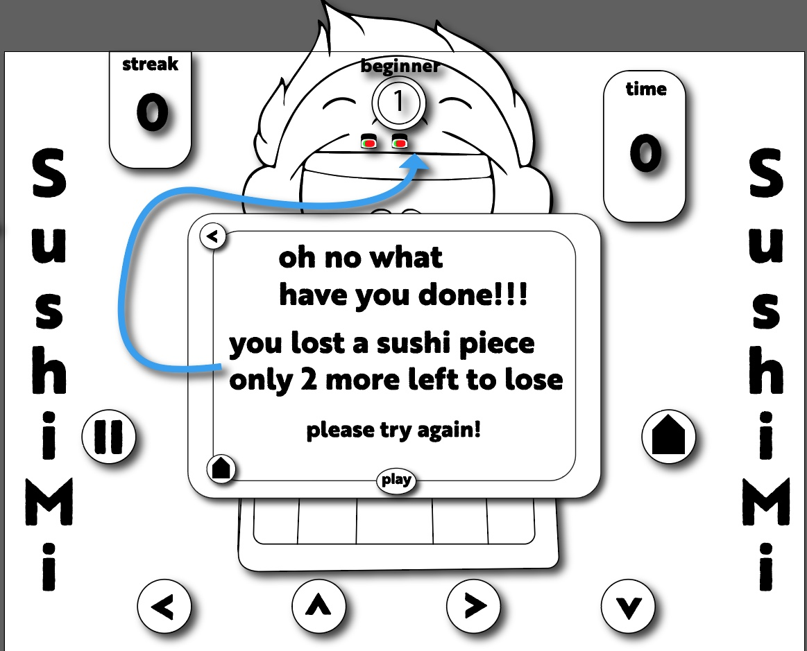

# **SushiMi**

You must feed the sushi to the customer in a very particular fashion.
You will watch the computer show you the pattern and then you must do the same. If you dont it could have dier consaquences.

---

## How to play

- You will start on the homescreen. The homescreen will give you a pop up with minor instructions and board layout guide.

- **Next**

  - The computer will show you the
    pattern to follow and all you have to
    do is duplicate it.

  - Then the player will grab the sushi piece.

  - The player will move by the arrow buttons placed on screen.

- You will have 3 sushi pieces to play.
  if you loose a round you loose a
  sushi piece.

- Winning move

- one last thing you’ll have a timer.........

---

## **User Stories**

Player will follow the pattern layed out by the computer.

Once it is the players turn.

- Player will have to place the sushi piece on the square the computer placed the sushi piece at first.

  - If player fails to place at the correct location. The player looses a sushi piece and then is led to a pop up with a direction to follow.

- If the player places the sushi piece in the correct location, now the player must follow the pattern layed out by the computer.

- If the player fails the pattern. The player looses a sushi piece and is brought to a pop up with directions.

- If the player succeeds. Another pop up appears to congratulate the player and move them to the next round.

The rounds will get progressively harder.

---

### **MVP** checklist

- Player will be able to see the computer layout pattern to follow.
- Player will be able move through the board.
- Winning/lossing logic
- Streak scale functional
- Buttons working as they should
- In-game direction pop up
- 3-5 board levels completed

### Stretch Goals

- animation
  - computer slide animation
  - player 1 slide push animation
  - player grab animation
  - in game direction pop up animation
- Timer

---

---

#### Technologies needed

- HTML
- CSS
- JS
  - Canvas
